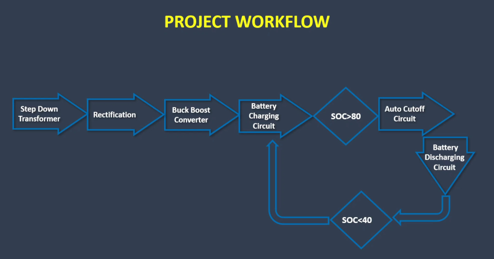
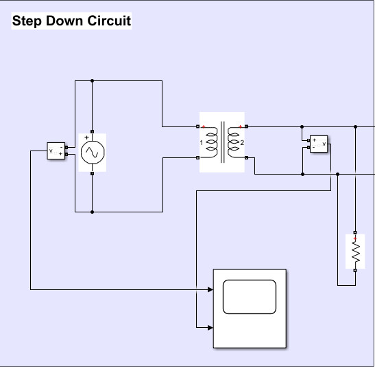
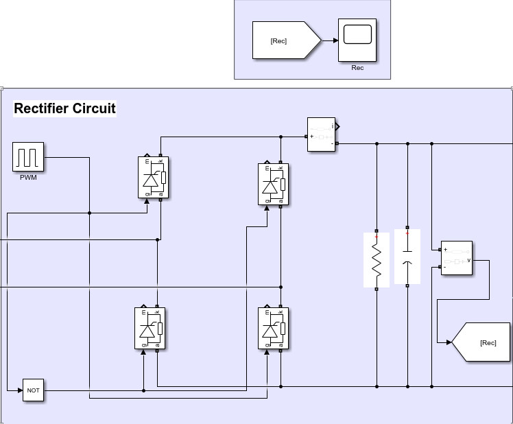
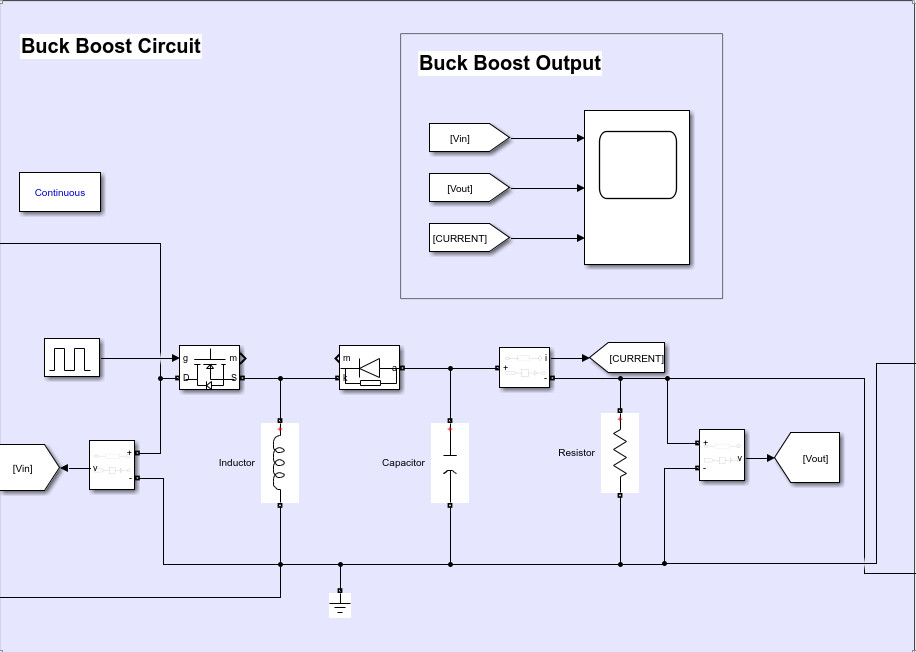
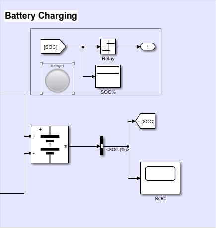
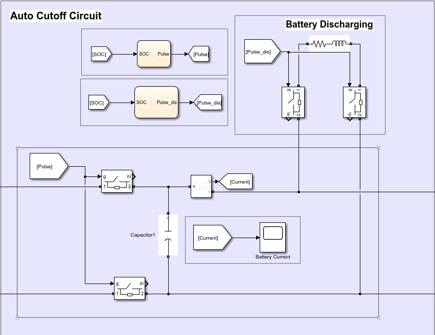
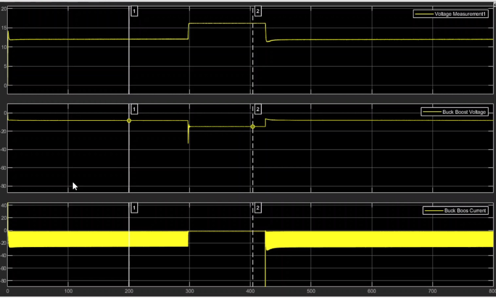
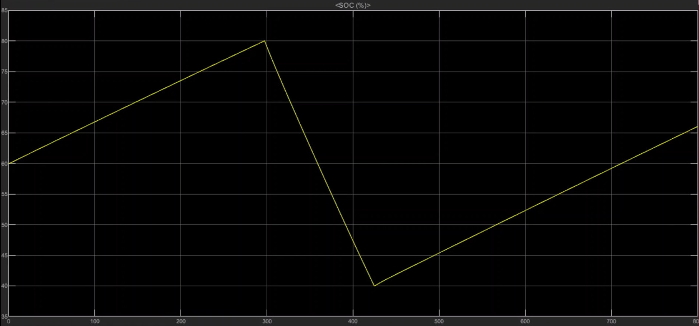

# Buck-Boost-Converter-with-Auto-Cutoff-Feature
Battery Charger with Variable DC Output Using a Buck-Boost Converter with Auto-Cutoff Feature

The whole project can be divided into the following modules
  1. Step-down transformer
  2. Rectifier
  3. Buck-Boost Converter
  4. Battery Charging Circuit
  5. Battery Discharging Circuit
  6. Auto-cutoff Circuit

 

## **Project Workflow**
 

   

   

## **Step-Down Circuit**
 

   

   
## **Rectifier**
 

   

   

## **Buck-Boost**
 

   

   

## **Battery Charging Circuit**
 

   

   

## **Auto-Cutoff & Battery Discharging Circuit**
 

   

   

## **Results**
 

   

   

   

 

From the result, it can be observed that battery gets auto-cutoff when its charge reaches 80%. After that the battery gets connected to discharging circuit. When battery charge discharges to 40%, it starts to charge again through battery charging circuit.

# Buck-Boost-Converter-with-Auto-Cutoff-Feature
Battery Charger with Variable DC Output Using a Buck-Boost Converter with Auto-Cutoff Feature

The whole project can be divided into the following modules
  1. Step-down transformer
  2. Rectifier
  3. Buck-Boost Converter
  4. Battery Charging Circuit
  5. Battery Discharging Circuit
  6. Auto-cutoff Circuit

 

## **Project Workflow**
 

   

   

## **Step-Down Circuit**
 

   

   
## **Rectifier**
 

   

   

## **Buck-Boost**
 

   

   

## **Battery Charging Circuit**
 

   

   

## **Auto-Cutoff & Battery Discharging Circuit**
 

   

   

## **Results**
 

   

   

   

 

From the result, it can be observed that battery gets auto-cutoff when its charge reaches 80%. After that the battery gets connected to discharging circuit. When battery charge discharges to 40%, it starts to charge again through battery charging circuit.

 

## **Contributors**
1. Md. Tasnim Azad
2. Samin Zawad
3. Mahadi Hassan
4. Kazi Moheuddin Alamgir
